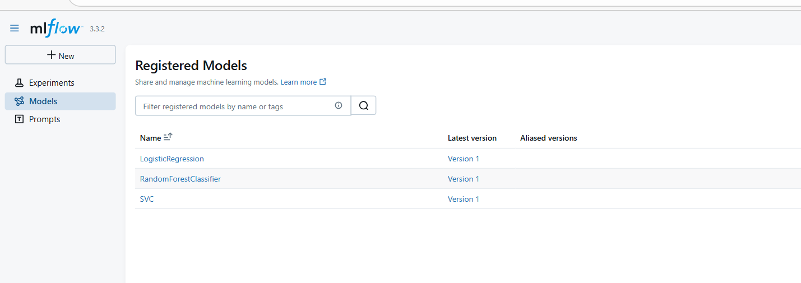
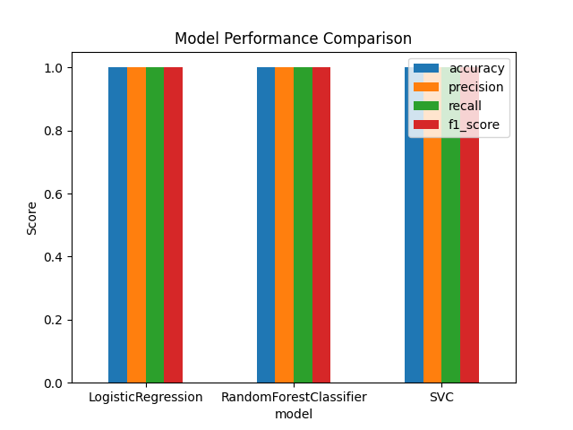

## MLOps Assignment 1 

# MLflow Tracking & Model Registry

This repository implements an end-to-end experiment tracking and model registry workflow using **MLflow**.  
I train multiple ML models, log their parameters/metrics/artifacts, compare them in MLflow UI, and register models in the MLflow Model Registry.

---

## 1. Problem statement & dataset description

**Problem statement**  
Classify iris flowers into three species based on sepal and petal measurements.

**Dataset**  
I used the built-in **Iris dataset** from `sklearn.datasets`. The dataset contains 150 samples and 4 features:
- sepal length, sepal width, petal length, petal width
- target classes: Setosa, Versicolor, Virginica

---

## 2. Model selection & comparison

I trained and compared the following models:
- **Logistic Regression** (scikit-learn)
- **Random Forest Classifier**
- **Support Vector Machine (SVM)**

For each model I logged:
- hyperparameters (via `mlflow.log_params`)
- evaluation metrics: **accuracy, precision, recall, F1** (via `mlflow.log_metrics`)
- artifacts: confusion matrix PNG, evaluation CSV, comparison chart

**Note about results:** On the Iris dataset, all three models achieved identical high performance. I therefore registered all three models to demonstrate the model registry workflow.

---

## 3. MLflow logging — required screenshots

**Screenshots required :**
1. `results/screenshots/mlflow_experiments.png` — Experiments list page.

2. `results/screenshots/mlflow_run_details.png` — A single run's Overview (metrics + params).


3. `results/screenshots/mlflow_artifacts.png` — Artifacts view (confusion matrix / plots visible).


4. `results/screenshots/mlflow_models_tab.png` — Models tab showing registered models.

5. `results/screenshots/comparison_plot.png` — The comparison chart (`results/model_comparison.png`).



  
*Figure 1 — MLflow experiments overview.*

  
*Figure 2 — Run details with metrics and parameters.*

  
*Figure 3 — Artifacts (confusion matrix / plots).*

  
*Figure 4 — MLflow Models tab (registered models & versions).*

  
*Figure 5 — Comparison of model metrics across runs.*

---

## 4. Monitoring & Model Registration 

1. Monitoring MLflow runs  
   - I started the MLflow UI (`mlflow ui`) and navigated to `http://127.0.0.1:5000`.  
   - I verified each run logged parameters, metrics (accuracy, precision, recall, F1), and artifacts (confusion matrix PNG, evaluation CSV and plots).  
   - I used the Experiments view to compare runs side-by-side.

2. **Selecting the best-performing model (my decision)**  
   - On the Iris dataset, Logistic Regression, Random Forest, and SVM all achieved identical performance (accuracy, precision, recall, F1 ≈ 1.0).  
   - Because there was no clear best model, I **registered all three models** in the MLflow Model Registry to preserve them for future use.

3. **How I registered the models**  
   - After training each model and logging it to an MLflow run, I captured the run id and called `mlflow.register_model()` for each run.  
   - Example code (used in project):  
     ```python
     model_uri = f"runs:/{run_id}/{model_name}"
     mlflow.register_model(model_uri, name=model_name)
     ```
   - This created versioned entries under the MLflow Models tab (each model starts at version 1).

4. **Reflection**  
   - Registering all three models allowed me to practice model versioning and lifecycle management.  
   - In production, I would pick the best model based on cross-validation, deployment constraints, and business priorities; here I documented why I registered all three.

---

## 5. How to run the project (reproducibility)

### 1. Clone & setup

git clone https://github.com/<your-username>/mlops-assignment-1.git
cd mlops-assignment-1
python -m venv .venv
.venv\Scripts\activate    # Windows (PowerShell)
pip install -r requirements.txt

## Objective
This project is for Assignment 1 of MLOps.  
It involves:
- Training and comparing ML models
- Using MLflow for experiment tracking
- Registering the best model

 ## MLflow Tracking & Model Registry

## Setup

1. **Activate Virtual Environment**  
.venv\Scripts\


2. **Install Dependencies**  
pip install -r requirements.txt
   


## Running the Project

1. **Start MLflow UI**
mlflow ui
Open: [http://127.0.0.1:5000](http://127.0.0.1:5000)

2. **Train Models** (in a new terminal)  
python src/train.py

- Models: Logistic Regression, Random Forest, SVM  
- Logs: parameters, metrics, artifacts  
- Comparison run created  

---
## Monitoring & Model Registration

### 1. Monitoring MLflow runs
- Use the **MLflow UI** to observe and compare runs.
- Check that **parameters**, **metrics** (accuracy, precision, recall, F1), and **artifacts** (confusion matrices, CSV files, plots) are logged correctly.
- Compare models side by side in the **Experiments** view.

### 2. Selecting the best-performing model
- Logistic Regression, Random Forest, and SVM all achieved perfect scores (**accuracy, precision, recall, F1 = 1.0**).
- Since performance is equal, **all three models were registered**.

### 3. Model Registration in MLflow
- Registered models:
  - `LogisticRegression` → Version 1
  - `RandomForestClassifier` → Version 1
  - `SVC` → Version 1
- Each model is **tracked, versioned**, and can be promoted through stages like **Staging** or **Production**.

### 4. Reflection
- Practiced managing multiple models in parallel using MLflow.

### To View Registered Models
- Open **MLflow UI → Models tab**  
- You will see all three models with **linked training runs, metrics, and artifacts**.
